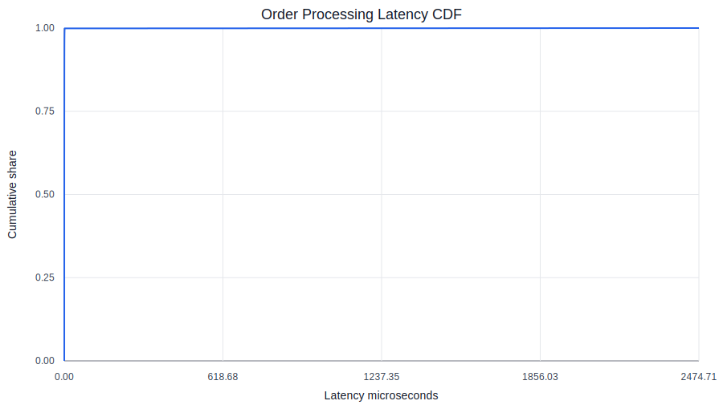

# Research Note

This note is the full stage-by-stage record for the C++ limit order book and market making simulator. The README is intentionally short; this file keeps the measured numbers, reproduction commands, caveats, and interpretation changes in one place.

## Project Summary

This repository is a systems focused market microstructure project. Stage 1 implements a deterministic matching engine for one instrument with price time priority, partial fills across levels, cancellation, replacement, self trade prevention, CSV replay, and direct external execution support for replaying named exchange executions.

Stage 2 adds a reproducible benchmark harness for deterministic synthetic order flow. On the hardware listed below, the engine processed 1,000,000 synthetic order events at 3,723,012 events per second. This is a measured result, not a target.

Stage 3 adds naive symmetric and Avellaneda Stoikov market maker simulations with PnL attribution, reconciliation checks, and regime comparisons. Stage 5C later reruns these comparisons across 30 seeds per regime and narrows the claim: the strongest result is selected risk reduction and risk-adjusted improvement under hand chosen flow, not broad PnL dominance. The AS runs also show a measured tradeoff: inventory reducing fills account for most AS adverse selection cost. See [stage3_results.md](stage3_results.md) and [stage5c_seed_statistics.md](stage5c_seed_statistics.md).

Stage 4A replays a bounded public Nasdaq TotalView ITCH sample through the matching engine, including direct `external_execute` handling for named resting order executions. Stage 4B fits a regular session QQQ fill decay curve, validates that the decay effect is statistically robust, and compares the calibrated AS parameter against the original hand chosen AS value. The calibrated result depends on the tick to cent bridge between real QQQ data and the synthetic simulator. See [stage4b_strategy_comparison.md](stage4b_strategy_comparison.md).

Stage 4C adds inventory caps, soft quote skew, explicit terminal liquidation, terminal inventory penalty, and risk adjusted PnL. With a 20000 unit cap, terminal liquidation closes all controlled runs to zero final inventory. Stage 5C shows that controlled high volatility has a separated AS inventory variance reduction; the paired same-seed delta addendum also separates risk adjusted PnL in favor of AS, while net PnL still does not separate. See [stage4c_results.md](stage4c_results.md).

Stage 4D adds a fixed range `FlatOrderBook` behind the same matching logic as the map book. The Stage 1 matching tests now run against both engines. On one paired one million event Stage 2 benchmark stream, the flat book processed 5,332,518 events per second versus 4,618,931 for the map book. Follow up reconciliation showed the exact speedup is run length and host noise sensitive, so this is evidence that the flat book can outperform the map book on this stream, not a universal array book speedup claim. See [stage4d_flat_order_book.md](stage4d_flat_order_book.md).

Stage 5A corrects ITCH execution replay semantics by using direct named order execution instead of synthetic market orders for unknown aggressors. Stage 5B adds an ITCH calibrated synthetic flow profile beside the original hand chosen flow. Under the calibrated profile, the market maker fill rate drops from roughly 43 to 50 percent to roughly 1.5 to 1.8 percent because the Stage 4A input had only 57 external executions across 12,423 translated events. See [stage5b_itch_calibrated_flow.md](stage5b_itch_calibrated_flow.md).

Stage 5C adds a 30 seed statistical pass for hand chosen and ITCH calibrated flow, uncontrolled and risk controlled modes. It checks both separate confidence interval overlap and paired same-seed strategy deltas. All 1,080 raw seed rows reconcile true. The paired addendum produces 8,640 paired delta rows, 288 summary rows, and 288 claim rows, with 81 changed conclusions versus unpaired interval overlap. See [stage5c_seed_statistics.md](stage5c_seed_statistics.md).

Stage 5D adds queue position diagnostics for market maker quotes. Deterministic tests confirm that market maker quotes use the same FIFO price level priority as external orders. The one-seed diagnostic shows queue depth is a real fill filter, but the ITCH calibrated fill-rate collapse is still dominated by sparse execution flow: even front-of-queue ITCH calibrated quotes fill around 1.8 to 2.0 percent versus roughly 72 to 74 percent for front-of-queue hand chosen quotes. See [stage5d_queue_position.md](stage5d_queue_position.md).

## What Stage 1 Proves

1. Modern C++ structure with RAII, value semantics, const correctness, and CMake.
2. A mutable order book using ordered price levels and FIFO queues.
3. Deterministic matching behavior covered by unit tests and a CSV integration test.
4. Explicit edge case policy documented in [edge_cases.md](edge_cases.md).

The matching engine stores bids in a descending `std::map`, asks in an ascending `std::map`, and each price level in a `std::list<Order>`. The active order index maps order ID to side, price, and list iterator, so cancel and quantity reduction do not scan the full book. Same-price priority is timestamp first, then order ID as a deterministic tie break.

## Stage 2 Benchmark Result

Measured command:

```bash
CMAKE=/tmp/lob_cmake_venv/bin/cmake python3 benchmarks/run_benchmark.py --events 1000000 --warmup 20000 --seed 42 --output-dir benchmarks/results/stage2_local --build-dir build/stage2_benchmark
```

If CMake is already on `PATH`, omit the `CMAKE=...` prefix.

Measured output:

```text
processed 1,000,000 synthetic order events at 3,723,012 events per second
p50 latency 125 ns
p95 latency 667 ns
p99 latency 1208 ns
max latency 2222959 ns
rejects 0
```

Hardware and toolchain:

```text
CPU Apple M3
logical cores 8
RAM 16 GB
OS macOS 26.5.1
compiler Apple clang 21.0.0
CMake 4.3.4
build type Release
```

The synthetic event mix is an explicit benchmark assumption, not a claim about any specific exchange venue:

```text
limit 599,535 events, 59.9535 percent
market 100,566 events, 10.0566 percent
cancel 199,619 events, 19.9619 percent
modify 100,280 events, 10.0280 percent
```



See [performance.md](performance.md) for the benchmark method, memory notes, tail-latency investigation, and limitations.

## Stage 3 Market Maker Result

Measured command:

```bash
CMAKE=/tmp/lob_cmake_venv/bin/cmake python3 simulations/run_market_maker.py --strategy naive --events 200000 --markout-horizon 50 --curve-sample-stride 100 --output-dir benchmarks/results/stage3_naive_checkpoint --build-dir build/stage3_market_maker
CMAKE=/tmp/lob_cmake_venv/bin/cmake python3 simulations/run_market_maker.py --strategy avellaneda-stoikov --events 200000 --markout-horizon 50 --curve-sample-stride 100 --output-dir benchmarks/results/stage3_avellaneda_stoikov_checkpoint --build-dir build/stage3_market_maker
python3 simulations/compare_market_makers.py --naive-dir benchmarks/results/stage3_naive_checkpoint --as-dir benchmarks/results/stage3_avellaneda_stoikov_checkpoint --output-dir benchmarks/results/stage3_comparison
```

Key inventory results:

```text
low volatility: final inventory 60352 naive, 53714 Avellaneda Stoikov
high volatility: final inventory 10270 naive, 1178 Avellaneda Stoikov
trending: final inventory 22260 naive, 27169 Avellaneda Stoikov
```

The full attribution table is checked in at `benchmarks/results/stage3_comparison/metrics_table.csv`. Net PnL is not reported as a standalone success metric because this toy environment permits large unhedged inventory exposure.

Stage 3 also records the Avellaneda Stoikov adverse-selection mechanism. AS adverse selection cost is higher than naive in every regime, and the fill split shows that most of that cost comes from inventory-reducing fills: `94.6%` in low volatility, `88.8%` in high volatility, and `87.3%` in trending. This supports the mechanism that AS pays adverse selection to reduce inventory risk.

## Stage 4A ITCH Replay Result

Measured command:

```bash
CMAKE=/tmp/lob_cmake_venv/bin/cmake python3 tools/itch_replay.py --symbol QQQ --range-bytes 33554432 --output-dir benchmarks/results/stage4a_itch_replay --build-dir build/stage4a_itch_replay
```

The replay translated `12423` QQQ messages from a bounded prefix of the public Nasdaq TotalView ITCH sample file `03272019.NASDAQ_ITCH50.gz` and replayed them through the existing matching engine. The observed event mix was `47.5730499879` percent limit, `0` percent market, `0.458826370442` percent external execution, `47.2027690574` percent cancel, and `4.76535458424` percent modify.

The replay summary was:

```text
source file 03272019.NASDAQ_ITCH50.gz
symbol QQQ
compressed prefix bytes 33554432
decompressed prefix bytes 83901990
messages read 2879078
supported QQQ messages 12423
translated events 12423
replay trades 57
```

Cancel and lifetime metrics:

```text
executed quantity 11941
removed quantity 7968210
removed to executed quantity ratio 667.29838372
closed order count 5875
p50 lifetime ns 2906518162
p95 lifetime ns 106025741539
max lifetime ns 3152000868845
delete closures 5864
execution closures 11
```

Orders still open at the end of the captured window are excluded from the lifetime percentile calculation as right-censored observations. The bounded prefix may be biased toward early session book maintenance, so the ITCH replay is a real-data check, not a full-day market reconstruction.

See [stage4a_replay.md](stage4a_replay.md) for the source, limitations, translation rules, and comparison against the Stage 3 synthetic assumptions.

## Stage 5A Execution Replay Correction

Stage 5A changes the replay boundary by adding direct `external_execute` handling. ITCH `E` and `C` execution messages name the exact resting order that executed; replay now reduces that named order directly instead of inventing an opposite-side synthetic market order.

The historical market-order translation can still be reproduced:

```bash
CMAKE=/tmp/lob_cmake_venv/bin/cmake python3 tools/itch_replay.py --symbol QQQ --range-bytes 33554432 --execution-mode market --output-dir benchmarks/results/stage5a_itch_market_mode --build-dir build/stage5a_itch_replay
```

The corrected direct execution replay is:

```bash
CMAKE=/tmp/lob_cmake_venv/bin/cmake python3 tools/itch_replay.py --symbol QQQ --range-bytes 33554432 --output-dir benchmarks/results/stage4a_itch_replay --build-dir build/stage5a_itch_replay
```

The comparison command is:

```bash
python3 tools/compare_itch_execution_modes.py --market-dir benchmarks/results/stage5a_itch_market_mode --external-dir benchmarks/results/stage4a_itch_replay --output-dir benchmarks/results/stage5a_execution_mode_comparison
```

The checked comparison reports:

```text
market_replay_trades 57
external_replay_trades 57
market_trade_quantity 11941
external_trade_quantity 11941
trade_count_match true
trade_quantity_match true
changed_price_or_quantity_rows 0
changed_full_trade_rows 57
market_book_rows 35
external_book_rows 35
book_state_match true
market_translated_zero_order_id_rows 0
external_translated_zero_order_id_rows 0
market_min_translated_order_id 16079
external_min_translated_order_id 16079
external_unknown_aggressor_trade_rows 57
replay_rejections 0
external_execute_rejections 0
```

The total executed quantity matches, no replayed trade changed price or quantity, and the final open book state matches. All `57` full trade rows changed because the historical run used invented synthetic market order IDs, while the corrected run records the unknown aggressor as order ID `0`. The `0` aggressor ID is safe because the matching engine rejects incoming order ID `0`, the Stage 2 benchmark generator starts at `1`, market maker quote IDs start at `1000000000000`, and this QQQ translated input has `0` rows with order ID `0`.

## Stage 4B Calibrated Strategy Result

The default Stage 4B calibrated AS run assumes one synthetic tick equals one real cent and uses the fitted QQQ regular session decay:

```text
fill_decay 0.63274456291
```

The original hand chosen AS value was:

```text
fill_decay 0.25
```

Measured comparison against original AS:

```text
low volatility net PnL change -467729.3851, final inventory change -78
high volatility net PnL change -196960.86527, final inventory change -122
trending net PnL change -304528.75032, final inventory change -643
```

Under that direct mapping, the calibrated strategy improves final inventory slightly in all three regimes, but it lowers spread capture and raises adverse selection cost enough to reduce net PnL.

The fitted exponential decay itself is statistically robust. The likelihood ratio statistic is `150.8215046`, the fitted decay is `0.63274456291`, and the 95 percent confidence interval is `[0.482450, 0.783038]`. The parity hypothesis was checked and not confirmed.

The tick size sensitivity check changes the broader conclusion:

```text
one tick equals 5 cents: calibrated AS net PnL beats original AS in all three regimes
one tick equals 20 cents: calibrated AS loses in low and high volatility, wins in trending
```

The full attribution table is checked in at `benchmarks/results/stage4b_strategy_comparison/metrics_table.csv`, and the unit sensitivity table is checked in at `benchmarks/results/stage4b_strategy_comparison/tick_size_sensitivity.csv`. See [stage4b_calibration_gate.md](stage4b_calibration_gate.md), [stage4b_intensity_measurement.md](stage4b_intensity_measurement.md), [stage4b_intensity_fit.md](stage4b_intensity_fit.md), and [stage4b_strategy_comparison.md](stage4b_strategy_comparison.md).

## Stage 4C Risk Control Result

Measured comparison:

```text
low volatility risk adjusted PnL 3.79145721962 naive, 3.65709628448 Avellaneda Stoikov
high volatility risk adjusted PnL 0.448401096106 naive, 2.18741584269 Avellaneda Stoikov
trending risk adjusted PnL 0.8467416267 naive, 1.9505626349 Avellaneda Stoikov
```

The full table is checked in at `benchmarks/results/stage4c_risk_controlled_comparison/metrics_table.csv`. The terminal liquidation price level evidence is checked in at `benchmarks/results/stage4c_risk_controlled_comparison/naive_terminal_liquidation_levels.csv` and `benchmarks/results/stage4c_risk_controlled_comparison/avellaneda_stoikov_terminal_liquidation_levels.csv`.

The per-trade terminal liquidation trace is checked in beside those files, and the controlled runs report `passive_taker_fills` as zero in every regime. Stage 5C later narrows the interpretation: controlled hand chosen high volatility has a separated AS inventory variance reduction, and the paired same-seed delta addendum also separates risk adjusted PnL in favor of AS, while net PnL still does not separate.

## Stage 4D Flat Book Result

Measured comparison:

```text
map book throughput 4618931.43599 events per second
flat book throughput 5332518.0411 events per second
flat throughput improvement 15.449170766 percent
map p99 875 ns
flat p99 791 ns
```

This is the checked paired one million event artifact. A reconciliation rerun found overlapping map throughput between the old Stage 2 commit and current code, and a five million event diagnostic gave map `3265328.77983` events per second versus flat `3202855.57994`. Treat the one million event improvement as workload and run dependent. The full comparison table is checked in at `benchmarks/results/stage4d_comparison/metrics_table.csv`, and the reconciliation table is checked in at `benchmarks/results/stage4d_comparison/baseline_reconciliation.csv`.

The flat book rejects unsupported price ranges explicitly, and the benchmark refuses to run a flat replay when the generated stream contains out-of-range prices. See [stage4d_flat_order_book.md](stage4d_flat_order_book.md).

## Stage 5B ITCH Calibrated Synthetic Flow

Stage 5B keeps the original hand chosen synthetic generators and adds an `itch_calibrated` flow profile beside them. The calibrated event mix is taken from Stage 4A:

| Synthetic action | Stage 4A source | Count | Share |
| --- | --- | ---: | ---: |
| limit | new displayed orders | 5,910 | 47.5730499879 percent |
| market | `external_execute` events | 57 | 0.458826370442 percent |
| cancel | deletes | 5,864 | 47.2027690574 percent |
| modify | replace and partial cancel translations | 592 | 4.76535458424 percent |

The synthetic generator maps Stage 4A `external_execute` events to synthetic market or taker flow because forward generated streams do not have captured exchange order references to target. The market maker quote size remains at the Stage 3 default of `10` units per side, while ITCH calibrated average external limit size is roughly `1,300` to `1,350` units.

Stage 2 benchmark comparison:

| Flow profile | Events per second | p50 ns | p95 ns | p99 ns | Max ns | Trades | Market events | Cancel events |
| --- | ---: | ---: | ---: | ---: | ---: | ---: | ---: | ---: |
| hand chosen | 3,688,995.54185 | 166 | 667 | 1,167 | 2,229,667 | 350,663 | 100,566 | 199,619 |
| ITCH calibrated | 8,469,632.66144 | 84 | 166 | 250 | 968,792 | 31,066 | 4,486 | 470,520 |

Stage 3 strategy comparison under the calibrated flow:

| Flow | Strategy | Regime | Fill rate | Maker fills | Final inventory | Net PnL after fees | Inventory variance | Reconciled |
| --- | --- | --- | ---: | ---: | ---: | ---: | ---: | --- |
| hand chosen | naive | low volatility | 0.4928 | 21,122 | 60,352 | 12,552,342.9813 | 611,910,819.983 | true |
| hand chosen | naive | high volatility | 0.432215 | 18,538 | 10,270 | 1,781,174.93578 | 38,674,268.7726 | true |
| hand chosen | naive | trending | 0.458575 | 19,590 | 22,260 | 719,512.770379 | 112,831,901.12 | true |
| hand chosen | Avellaneda Stoikov | low volatility | 0.497845 | 21,338 | 53,714 | 11,445,840.4199 | 520,649,751.809 | true |
| hand chosen | Avellaneda Stoikov | high volatility | 0.430605 | 18,542 | 1,178 | 4,914,171.49318 | 18,918,445.1248 | true |
| hand chosen | Avellaneda Stoikov | trending | 0.4644075 | 19,886 | 27,169 | 5,380,110.11378 | 114,699,721.514 | true |
| ITCH calibrated | naive | low volatility | 0.0169525 | 679 | 487 | 123,046.303144 | 51,440.4058599 | true |
| ITCH calibrated | naive | high volatility | 0.0173275 | 694 | 11 | -52,167.7134593 | 9,913.30170706 | true |
| ITCH calibrated | naive | trending | 0.0150075 | 604 | 573 | 143,013.930154 | 46,310.0277564 | true |
| ITCH calibrated | Avellaneda Stoikov | low volatility | 0.0175275 | 702 | 497 | 122,949.38329 | 48,355.5043599 | true |
| ITCH calibrated | Avellaneda Stoikov | high volatility | 0.0174775 | 700 | 11 | -53,846.5134593 | 9,122.35137203 | true |
| ITCH calibrated | Avellaneda Stoikov | trending | 0.0152325 | 613 | 583 | 143,271.921605 | 48,308.383999 | true |

The calibrated flow changes the interpretation materially. Under hand chosen flow, both strategies get roughly `18,500` to `21,300` maker fills per regime; under ITCH calibrated flow, they get roughly `600` to `702` maker fills. This is not a PnL accounting change. It is the direct result of changing only the external event generator from a `25` percent taker flow in Stage 3 to the Stage 4A execution share of `57` out of `12,423` translated events. See [stage5b_itch_calibrated_flow.md](stage5b_itch_calibrated_flow.md).

## Stage 5C Multi-Seed Statistics

Stage 5C reruns the market maker comparison across `30` seeds per regime. It covers both external flow profiles, `hand_chosen` and `itch_calibrated`, and both modes used by the prior strategy docs:

```text
uncontrolled: Stage 3 style strategy comparison
risk controlled: Stage 4C style controls, terminal liquidation, inventory cap 20000
```

The run produced:

```text
raw rows 1080
combinations 36
samples per combination 30
all reconciled true
```

The first Stage 5C pass compared separate confidence intervals. The paired delta addendum then used the shared-seed design directly:

```text
paired delta rows 8640
paired delta summary rows 288
paired delta claim rows 288
changed conclusions versus unpaired interval overlap 81
```

After the paired delta addendum, the strongest statistically supported conclusions are:

```text
hand chosen, uncontrolled, high volatility: AS improves risk adjusted PnL and lowers inventory variance
hand chosen, uncontrolled, trending: AS lowers inventory and inventory variance, lowers net PnL, and improves risk adjusted PnL
hand chosen, risk controlled, high volatility: AS improves risk adjusted PnL and lowers inventory variance, while net PnL does not separate
hand chosen, risk controlled, low volatility and trending: AS lowers net PnL, while risk adjusted PnL does not separate
ITCH calibrated flow: paired deltas show small fill-rate and selected inventory-risk effects, but no AS risk adjusted PnL advantage
```

This is a useful correction, not a failure. The single seed runs were mechanism probes, and the original unpaired confidence intervals were a conservative first pass. Paired deltas are the better statistical test for this experiment because they respect the shared-seed design. The robust claim is selected risk-adjusted improvement and inventory-risk reduction under hand chosen flow, with weaker and sometimes negative PnL effects under ITCH calibrated flow. See [stage5c_seed_statistics.md](stage5c_seed_statistics.md).

## Stage 5D Queue Position Diagnostics

Stage 5D instruments market maker quote placement to separate distance from mid and displayed FIFO queue depth ahead at the same price. The diagnostic run uses one deterministic seed per regime, matching Stage 5C seed index `0`:

```text
low volatility seed 3001
high volatility seed 3002
trending seed 3003
```

It runs uncontrolled `naive` and original `avellaneda-stoikov` strategies across `hand_chosen` and `itch_calibrated` flow profiles.

The checked output contains:

```text
quote_queue_events rows 480000
queue_position_summary rows 12
fill_by_distance_bucket rows 58
fill_by_queue_depth_bucket rows 60
fill_by_distance_and_queue_bucket rows 230
```

The raw quote placement and fill outcome CSVs are checked in as compressed `.csv.gz` files because the uncompressed files exceeded GitHub's recommended `50 MB` file size. The compressed files preserve the raw data:

```text
benchmarks/results/stage5d_queue_position/quote_queue_events.csv.gz
benchmarks/results/stage5d_queue_position/quote_fill_outcomes.csv.gz
```

Market maker quotes already enter the same FIFO path as external limit orders. `submit_quote` builds an ordinary `Order::limit` with owner `market_maker` and sends it through `MatchingEngine::submit_order`. Stage 5D adds two deterministic queue priority tests, each run against both `lob::MatchingEngine` and `lob::FlatMatchingEngine`:

```text
market maker quote behind external queue waits for displayed depth ahead
market maker quote first at a price level fills before later external liquidity
```

No matching fix was needed. The existing FIFO behavior was correct; Stage 5D only adds explicit tests and diagnostics.

The first surprise is that ITCH calibrated quotes are not generally more buried at placement:

| Flow | Strategy | Regime | Average queue quantity ahead | Zero queue share | Fill probability |
| --- | --- | --- | ---: | ---: | ---: |
| hand chosen | naive | low volatility | 968.735650 | 0.676775 | 0.504325 |
| hand chosen | naive | high volatility | 221.113425 | 0.597900 | 0.443025 |
| hand chosen | naive | trending | 546.606350 | 0.627475 | 0.469250 |
| ITCH calibrated | naive | low volatility | 335.520050 | 0.809725 | 0.016975 |
| ITCH calibrated | naive | high volatility | 137.905525 | 0.905050 | 0.017350 |
| ITCH calibrated | naive | trending | 331.441200 | 0.807300 | 0.015075 |

Queue depth strongly affects fills within a flow, but the ITCH calibrated collapse remains even when queue depth ahead is zero. Naive hand chosen zero-queue fill probability is about `0.72` to `0.74`; naive ITCH calibrated zero-queue fill probability is about `0.018` to `0.020` in the main populated buckets. A quote at the front of the queue still needs incoming liquidity to arrive. The calibrated flow has only about `882` to `913` market events per 200,000 event run, compared with about `49,834` to `50,109` under hand chosen flow.

The Stage 5B mechanism is therefore narrowed:

```text
Sparse execution is still the dominant cause.
Queue depth is a real secondary filter when a quote has depth ahead.
The calibrated flow does not bury most market maker quotes at placement; zero-queue share is higher under ITCH calibrated flow than under hand chosen flow.
```

This is a one-seed diagnostic, not a 30-seed statistical pass. It is enough to answer the Stage 5B mechanism question at the checked seed, but it should not be read as a confidence interval result. See [stage5d_queue_position.md](stage5d_queue_position.md).

## Build And Test

```bash
cmake -S . -B build -DCMAKE_BUILD_TYPE=Release
cmake --build build --config Release
ctest --test-dir build --output-on-failure
```

## CSV Replay

Input CSV columns:

```text
timestamp,action,order_id,side,order_type,price,quantity,owner_id
```

For `new`, provide side, order type, quantity, and price for limit orders. For `cancel`, only timestamp, action, and order ID are required. For `modify`, quantity means the desired remaining open quantity, and price may be empty to keep the current price. For `external_execute`, provide timestamp, action, order ID, execution price, and execution quantity.

Run the sample replay:

```bash
./build/orderbook_replay data/sample_orders.csv build/sample_trades.csv
diff -u data/sample_expected_trades.csv build/sample_trades.csv
```

Output CSV columns:

```text
timestamp,buy_order_id,sell_order_id,maker_order_id,taker_order_id,price,quantity
```

## Current Stage Status

Stage 1, Stage 2, Stage 3, Stage 4A, Stage 4B, Stage 4C, Stage 4D, Stage 5A, Stage 5B, Stage 5C, and Stage 5D are complete once local tests pass and CI is green on `main`.

## Limitations

The engine handles one instrument and does not model trading sessions, auctions, hidden liquidity, pegged orders, minimum quantity, venue specific order attributes, recovery, or gateway sequencing.

The ITCH replay is a bounded public QQQ sample prefix, not a full-day market reconstruction.

The synthetic regimes are controlled experiments for mechanism testing, not live trading evidence.

The Stage 5D queue diagnostic is one-seed, not a confidence-interval result.

The large PnL numbers in the market maker simulations are a property of the toy environment allowing large unhedged inventory positions. They should not be interpreted as deployable market making skill.
